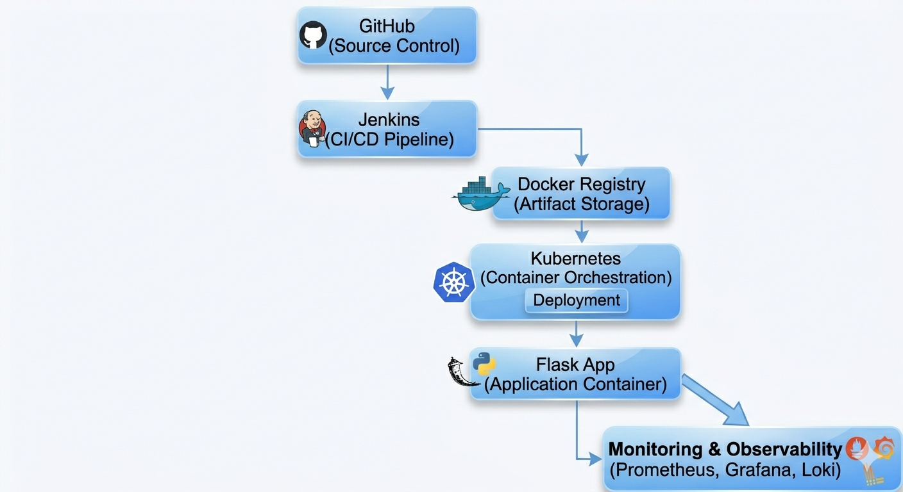

# devops-homelab
# DevOps Homelab Platform

## Overview

A full end-to-end DevOps homelab platform built on Ubuntu Server using Kubernetes, Docker, Jenkins, Terraform, Ansible, Prometheus, Grafana, and Loki.

This project demonstrates:
- CI/CD automation
- Kubernetes orchestration
- Infrastructure as Code
- Monitoring and logging
- Containerized deployments
- Rolling updates and rollback strategies

---

## Architecture

[ Add architecture diagram here ]

---

## Technologies Used

### Infrastructure
- Ubuntu Server
- Terraform
- Ansible

### Containers & Orchestration
- Docker
- Kubernetes (k3s)

### CI/CD
- Jenkins
- GitHub Webhooks

### Observability
- Prometheus
- Grafana
- Loki
- Promtail

### Networking
- Traefik Ingress
- Local DNS routing

---

## Features

- Automated CI/CD pipeline
- Rolling Kubernetes deployments
- Health checks and readiness probes
- Centralized logging
- Metrics dashboards
- Deployment rollback support
- Local Docker registry

---

## CI/CD Workflow

1. Developer pushes code to GitHub
2. GitHub webhook triggers Jenkins
3. Jenkins builds Docker image
4. Image pushed to local registry
5. Kubernetes deployment updated
6. Prometheus/Grafana monitor rollout
7. Loki collects deployment logs

---

## Monitoring Stack

- Prometheus scrapes cluster metrics
- Grafana visualizes dashboards
- Loki aggregates logs
- Promtail ships container logs

---

## Screenshots

### Jenkins Pipeline
[ add screenshot ]

### Grafana Dashboard
[ add screenshot ]

### Kubernetes Pods
[ add screenshot ]

---

## Kubernetes Commands

```bash
kubectl get pods -A
kubectl get svc -A
kubectl rollout history deployment/flask-homelab -n devops-homelab
```

---

## Future Improvements

- ArgoCD GitOps deployment
- HTTPS with cert-manager
- Multi-node Kubernetes cluster
- Secret management with Vault
- Trivy image scanning

---

## Lessons Learned

- Kubernetes networking and ingress
- CI/CD troubleshooting
- Observability implementation
- Deployment automation
- Container orchestration
- Helm package management


